# Queue
## Queue
큐(Queue)는 스택과 같이 데이터를 임시 저장하는 자료구조이다. 다만 스택과는 다르게   
먼저 넣은 데이터를 먼저 꺼내는 **선입선출 (FIFO)** 구조로 되어있다.   
>**삽입(enqueue)** : 큐에 데이터를 넣는다. O(1)   
> **삭제(dequeue)** : 데이터를 꺼낸다. front를 꺼낸후 이후 요소들을 앞쪽으로 옮긴다. O(N)

## 선형 큐
스택과 마찬가지로 1차원 배열을 통해 구현할 수 있다.   
큐의 크기는 배열의 크기와 같다.  

선형 큐는 **잘못된 포화상태 인식** 이라는 문제점이 존재한다.   
삽입과 삭제 반복 시 front가 뒤로 밀리며 자리가 있음에도 불구하고 포화상태로 인식하여   
더이상 삽입을 수행하지 못한다.     

이를 해결하기 위한 방법으론 위에 서술한 데이터를 꺼낸 후 요소들을 앞으로 당기는 방법이   
있지만 효율성이 떨어진다. 다음 방법으로는 링 버퍼(원형 큐)가 있다.   

## 원형 큐
**배열의 처음과 끝이 논리적으로 연결** 되어있다고 가정하는 큐이다.   
front와 rear의 위치가 배열의 마지막 인덱스(n-1)에서 논리적인 다음 자리인 인덱스 0번으로   
이동하기 위해 **나머지 연산(mod)** 를 사용한다.   
공백 상태와 포화 상태 구분을 위해 **front자리는 사용하지 않고 비워둔다.**
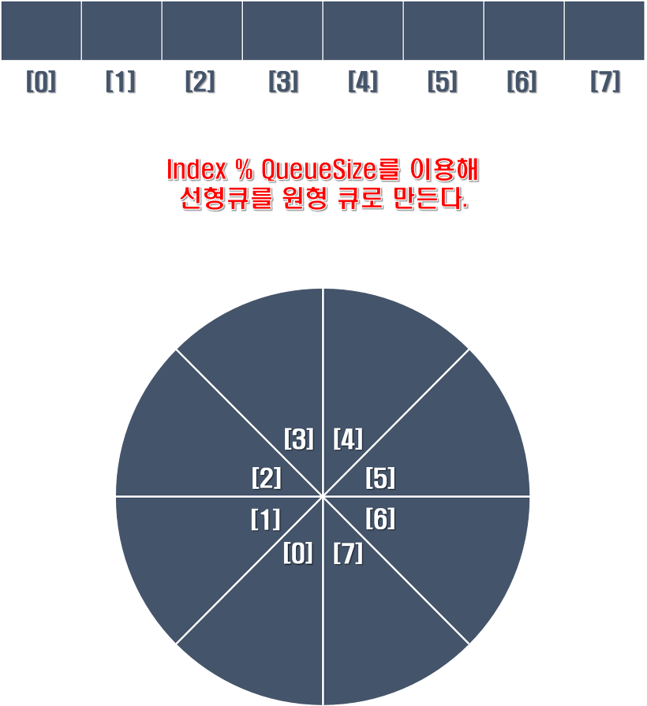

### Enqueue, Dequeue
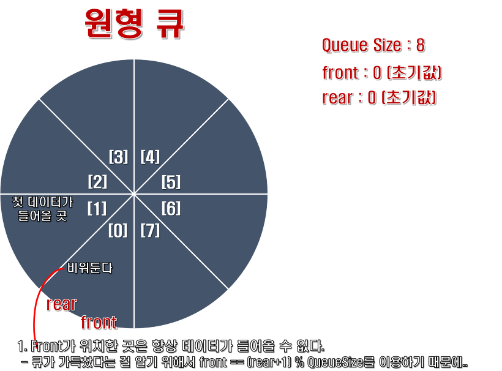
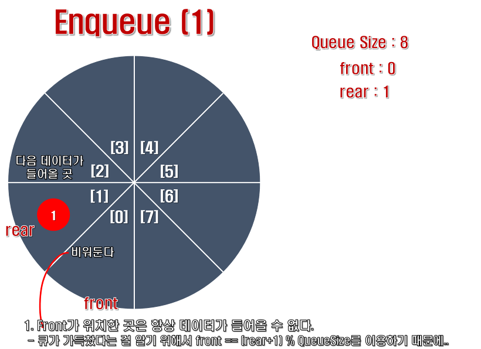
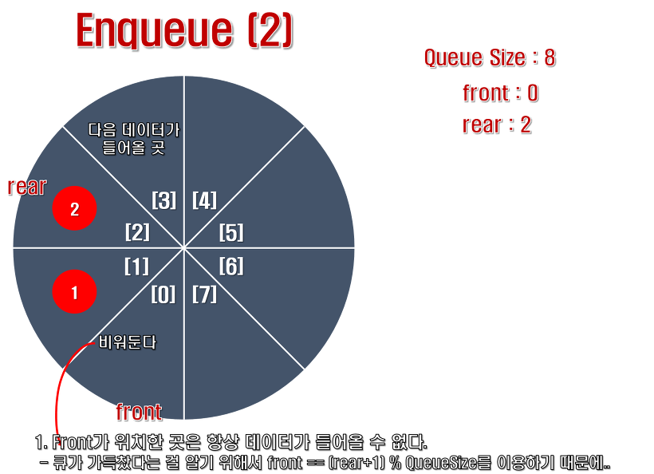
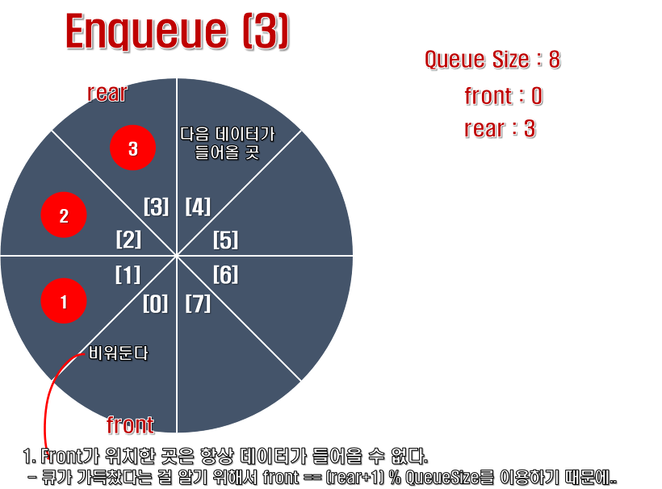
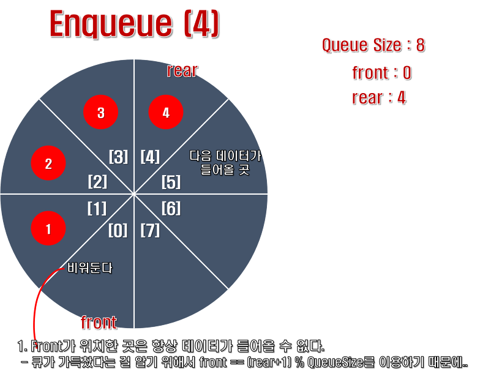
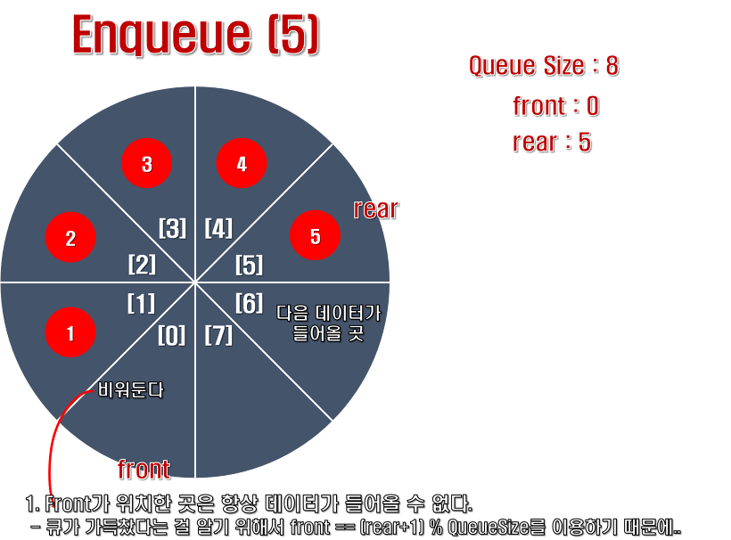
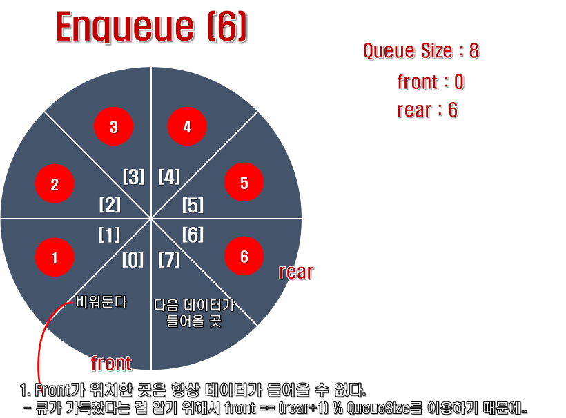
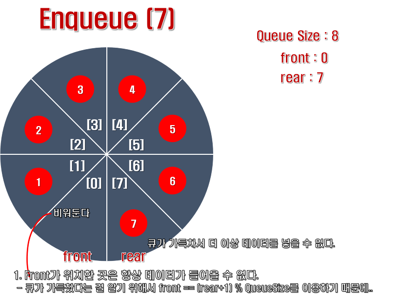
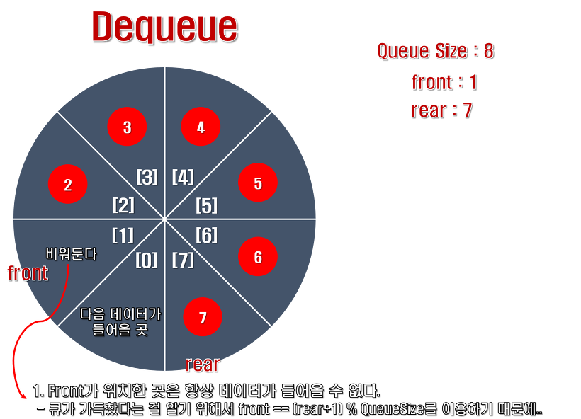
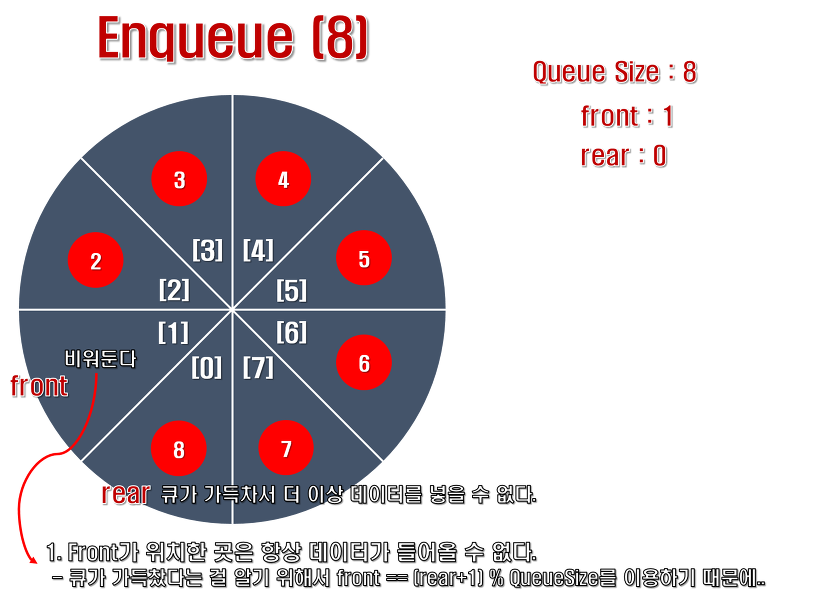
[이미지 출처](https://mailmail.tistory.com/41)

## 메소드
### 선언
```java
import java.util.Queue;
import java.util.LinkedList;

Queue<자료형> 변수명 = new LinkedList<>();
```
>|메소드|설명|   
>|--|--|   
>|add()|데이터 추가 / 성공시 true, 실패시 Exception|   
>|offer()|데이터 추가 / 성공시 true, 실패시 false|   
>|remove()|데이터 삭제 / 비어있는 경우 NoSuchElementException 발생|   
>|poll()|데이터 삭제 / 비어있는 경우 null|   
>|element()|큐 front에 위치한 value / 비어있는 경우 NoSuchElementException 발생|   
>|peek()|큐 front에 위치한 value / 비어있는 경우 null|   
>|clear()|큐 초기화|   
>|size()|큐 사이즈|   
>|contains()|해당 값이 존재할 때 true|
>|isEmpty()|비어있는 경우 true|   
